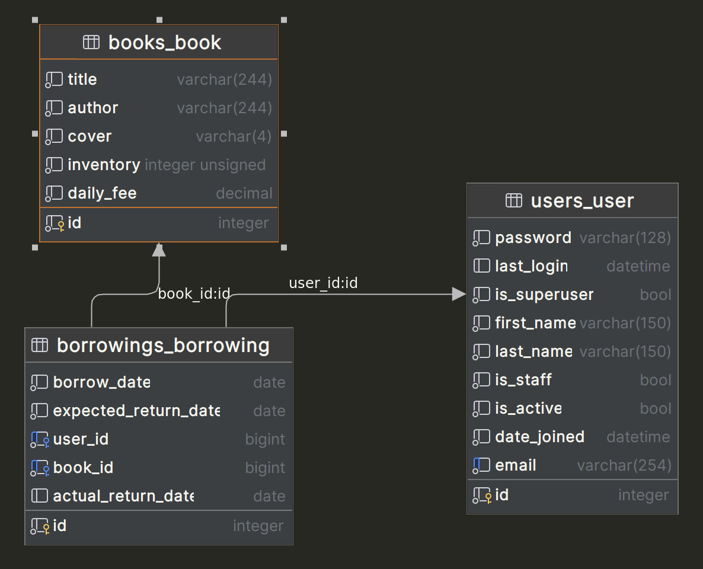
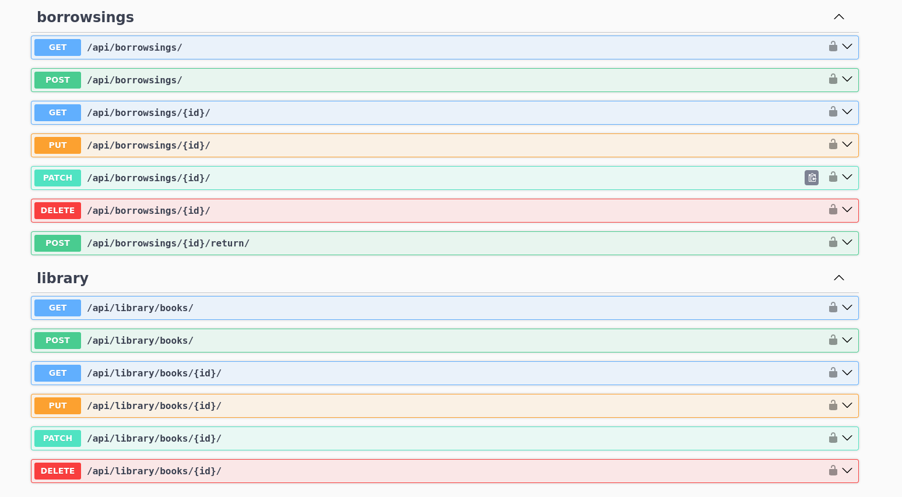
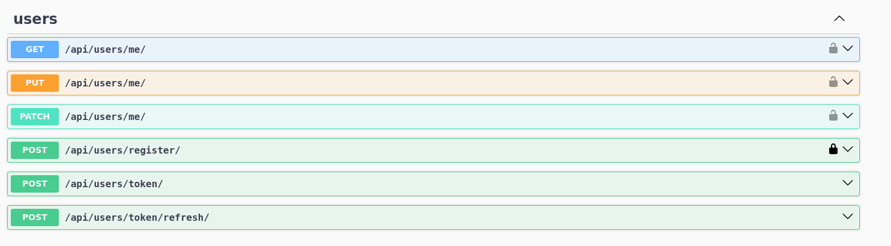

# Library API

API service for library management written on Django Rest Framework

## DB structure:

## Endpoints:

## Features

- JWT authenticated
- Admin panel
- Documentation is located at /api/doc/swagger/
- Pagination
- Authorization by email
- Add new books
- Manage Borrowings

## Technologies Used

Library API project is developed using the following technologies:

- Django Rest Framework
- Database: Sqlite

## Usage Instructions

Python must be already installed.

1. **Installation:**
    - Clone the repository to your local machine `https://github.com/IlyaGrynyshyn/LibraryService`.
    - Create virtual environment `python3 -m venv venv`
    - Install the required dependencies using `pip install -r requirements.txt`.

2. **Running:**
    - Apply migrations `python manage.py migrate`
    - Start the server with `python manage.py runserver`.
    - Access the store via `http://localhost:8000` in your web browser.

3. **Registration/Login:**
    - To access all functionalities of the project, create superuser and log in to your account.

## Getting access

- Create user via /api/user/register/
- Get access token via /api/user/token/

## Planned Enhancements
Future enhancements for the project include:
- Implement the possibility of sending notifications on each Borrowing creation
- Implement a daily-based function for checking borrowings overdue

## Developer Commands

- `python manage.py makemigrations`: Create database migrations.
- `python manage.py migrate`: Apply migrations to the database.
- `python manage.py createsuperuser`: Create a site administrator.

## Contribution

If you have ideas or would like to contribute to the project, please fork the repository and create a pull request.

Thank you for your interest in the "LibraryService" project!
